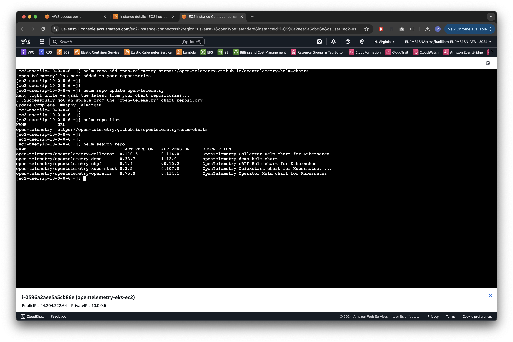
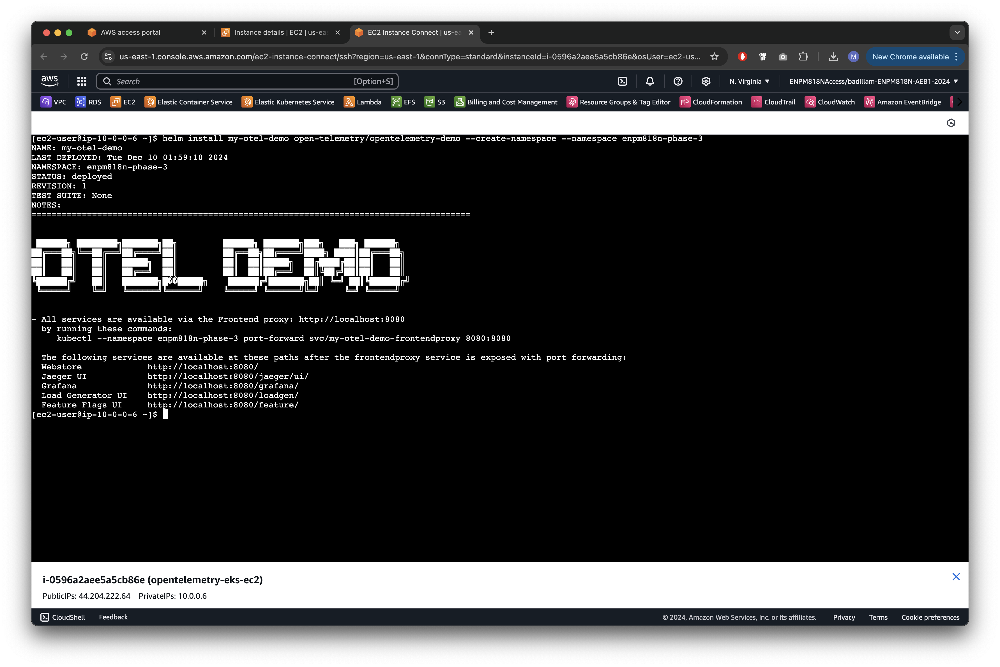
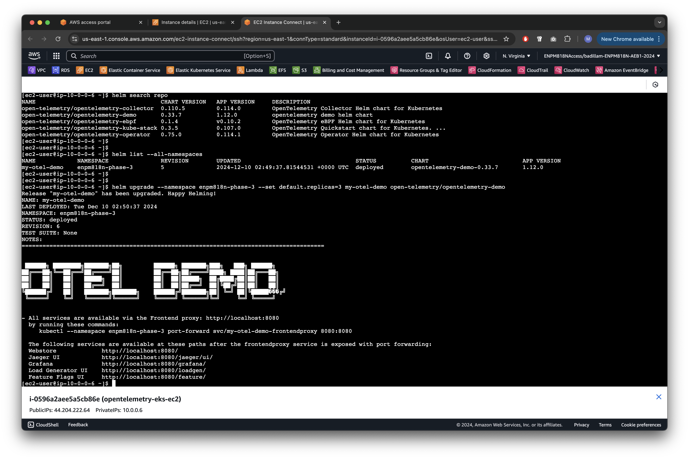
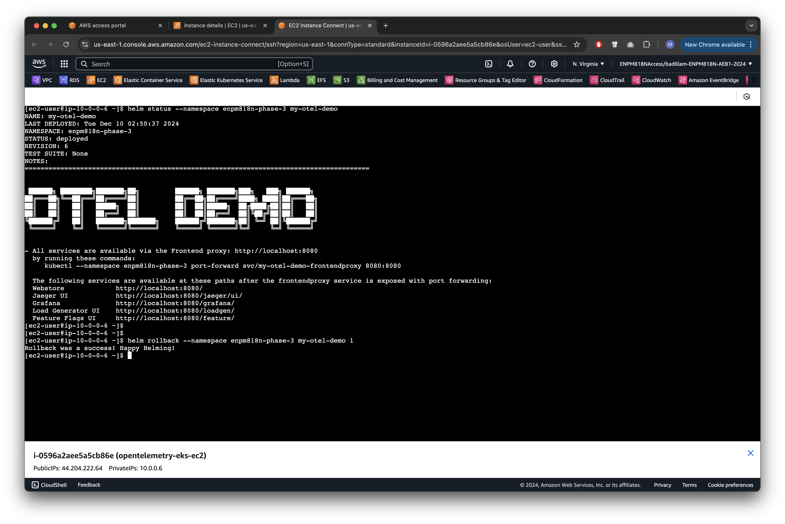
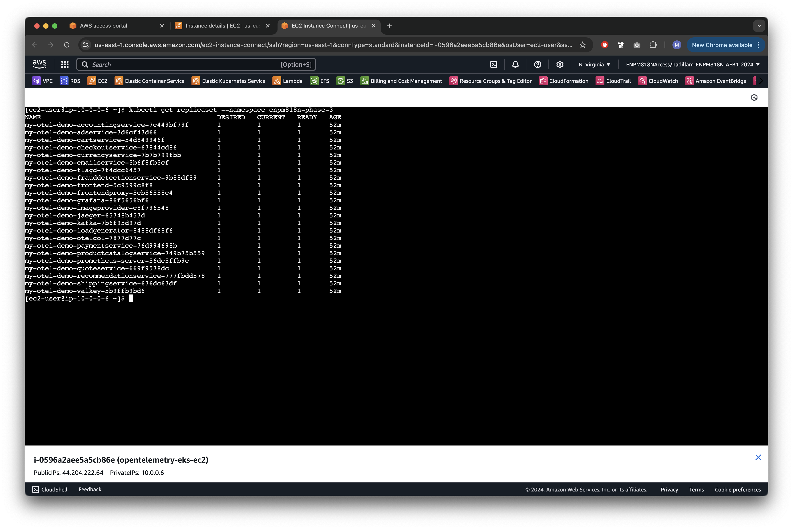
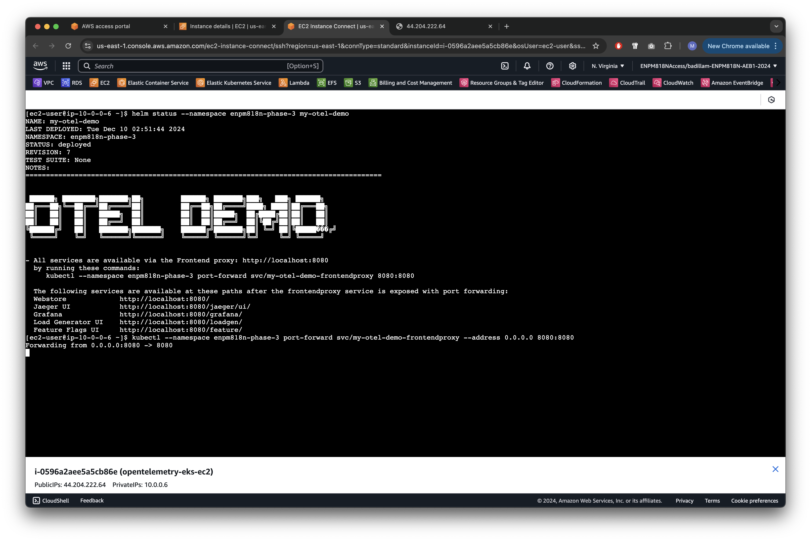

# Phase 3: Integrating Helm for Deployment

**Assigned to:** Marc Badilla

## Deliverables

- [x] 1. Screenshots of the Helm repository being added and updated.
- [x] 2. Screenshots of the application deployed successfully using Helm.
- [x] 3. Screenshots or logs of the upgrade process showing changes being applied.
- [x] 4. Screenshots or logs demonstrating a successful rollback to a previous version.

## Proof

Helm is a package manager for Kubernetes. Application developers may use charts to define all the Kubernetes resources needed for a successful deployment of their applications. The intent is to allow anyone without extensive knowledge of the application's underlying Kubernetes resources to run the application within any Kubernetes cluster.

### 1. Adding and Updating the Helm Repository

This is the first step in successfully deploying the OpenTelemetry demo via Helm. To confirm that the Helm repository was added and updated, I double-checked the reported version numbers against the `opentelemetry-demo` Helm chart's [Artifact Hub page](https://artifacthub.io/packages/helm/opentelemetry-helm/opentelemetry-demo). At the time of writing this, the Helm chart's version was at `0.33.7` and its application version was at `1.12.0`. All of this matches the screenshot.

### 2. Successful Helm Deployment

In order to create a new namespace for the Helm deployment, I specified the `--create-namespace` and `--namespace` options. The former indicates that the namespace needs to be created while the latter specifies the name of the new namespace. All future commands targeting `my-otel-demo`, the newly-installed `opentelemetry-demo` release, will also need to specify the namespace. Before moving on, I verified the deployment was working by checking the application endpoints. This was done by using `kubectl port-forward`, similar to what was done for the Kubernetes deployment in Phase 1.

This demonstrated the ease of deploying applications via Helm. The Kubernetes resources that are required to run the OpenTelemetry demo were abstracted away. I only relied on the experts from the OpenTelemetry team to create and publish the Helm chart, akin to application developers creating and publishing Docker images to Docker Hub.

### 3. Upgrade Process

In order to demonstrate the upgrade process, I decided to change the `default.replicas` configuration from `1` to `3`. Prior to taking the screenshots, I have been playing around with the `helm upgrade` command; the screenshot as a result shows that this is the 6th revision. Each modification and rollback to the release is recorded, providing a history of all changes done to my-otel-demo.

To perform a sanity check, I used `kubectl` to fetch a list of all ReplicaSets. Interestingly, only some of the ReplicaSets' desired sizes have been updated from `1` to `3`. The Artifact Hub page for `opentelemetry-demo` mentions that the setting I changed only affects "demo components." My interpretation of "demo components" is any component that is not relevant to the OpenTelemetry observability framework. Given more time, I can learn Helm's syntax and read through the source code to pinpoint how the `default.replicas` setting affects the deployment.

### 4. Rollback Demonstration

In order to demonstrate the rollback process, I decided to rollback all the way back to the 1st revision (technically, the rollback still counts as a revision, making this the 7th revision). The expected behavior is that the `default.replicas` configuration will revert from `3` to `1`. Rollback is a mechanism used to revert unintended or destructive changes to applications; from a potentially destructive state to a known good state. We can imagine that changing `default.replicas` to 3 was unintended and that the operator instead wanted to change a specific component's replica count (e.g., `shippingService.replicas`).

To perform a sanity check, I used `kubectl` to fetch a list of all ReplicaSet resources. As expected, all of the ReplicaSets' desired sizes have been reverted back to the default of `1`. After running all of the changes, I was still able to run the `kubectl port-forward` command and successfully access all of the same applications as the Kubernetes deployment in Phase 1.

